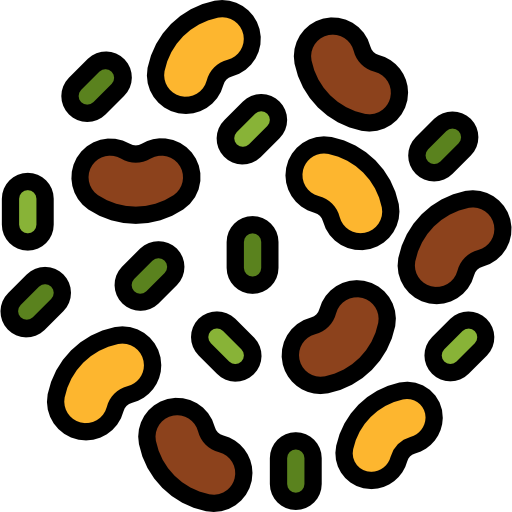

# MrBean 

Is a web application for simplifying the analysis of large-scale plant breeding experiments using spatial analysis, as implemented in the R-package `SpATS` (Rodriguez-Alvarez et al. 2018) . It provides the possibility for visualizing raw data, indentifying outliers, fitting mixed linear models (MLM) with or without spatial correction, retrieve BLUPs/BLUEs and heritabilites from single-environment trials. 

## Installation

If you do not have installed `devtools` package, first it is necessary :


``` r
install.packages("devtools")
```

and then

``` r
devtools::install_github("AparicioJohan/MrBean")
```


``` r
library(MrBean)
```


## Run the Shiny app

``` r
app_MrBean()
```

## Lastest version
If you want to have the latest version send me a message <a href = "mailto: j.aparicio@cgiar.org">Send Email</a>

## Demo

A running demo is on [shinyapps.io](https://beanteam.shinyapps.io/MrBean_v01/).

<div class="marvel-device macbook">
    <div class="top-bar" width=></div>
    <div class="camera"></div>
    <div class="screen">
             <iframe width="100%" src="https://beanteam.shinyapps.io/MrBean_v01/" allowfullscreen=""  scrolling="yes"  height="100%"></iframe>
    </div>
    <div class="bottom-bar"></div>
</div>
